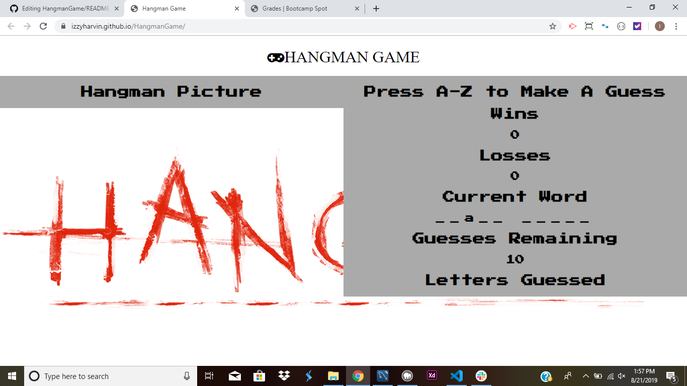
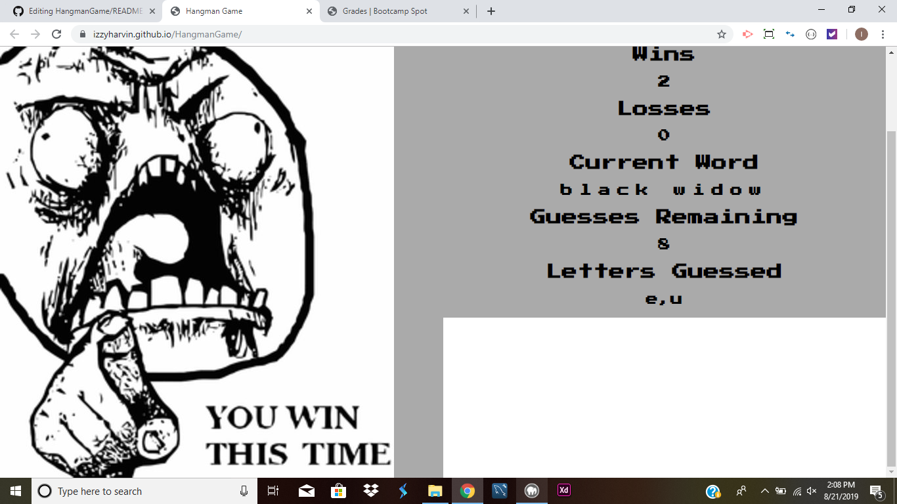
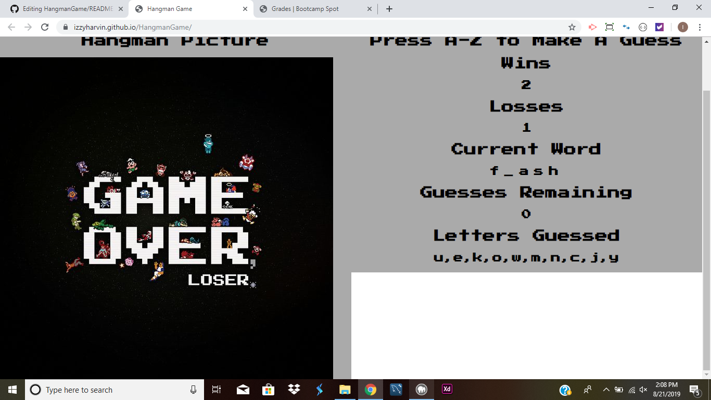
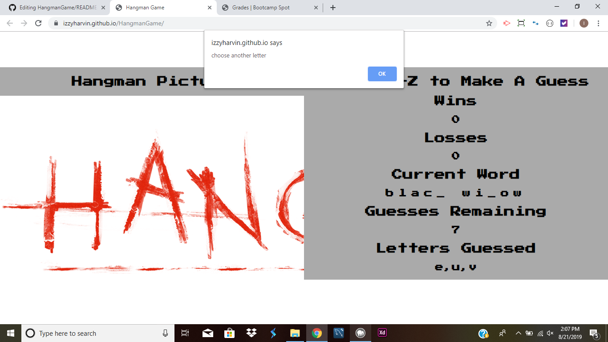

# HangmanGame

This webpage is simulating a Hangman game. You have 10 chances to get the right letter or you lose but if you guess the right word then you win.

# Link for app

- https://izzyharvin.github.io/HangmanGame/

# Languages used:

- HTML
- CSS
- Javascript

# How To Play Hangman Game

- First step is go to link and page will open up.

- Next, you choose the letter thats being guessed.

- Until, you win or lose.

- If you press a letter that you already choose it will show an alert.

Creator of App
Israel Harvin 6/29/2019
